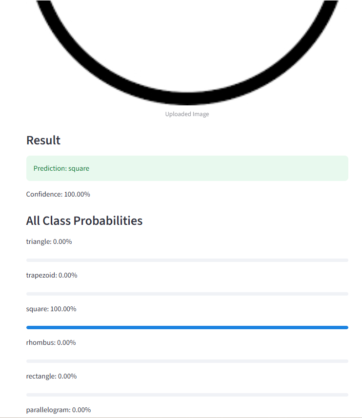

# 🔷 Geometric Shape Classifier

A web application built with **Streamlit** to classify geometric shapes using a trained **CNN deep learning model**.

---

## 🚀 Live Demo
👉 https://4b7txcqc5pjq25qxgjvbnu.streamlit.app/

---

## 📌 Features
- Upload an image from your device
- Predict the geometric shape
- Display prediction confidence
- Show class probabilities
- Simple and user-friendly interface

---

## 🧠 Model Details
- Built using **TensorFlow / Keras**
- Based on a **Convolutional Neural Network (CNN)**
- Input images are resized to **128x128**

---

## ⚙️ Technologies Used
- Python
- Streamlit
- TensorFlow
- NumPy
- Pillow
- gdown

---

## 🌐 Deployment
Deployed using Streamlit Community Cloud.

---

## 📸 App Preview

## 👤 Author
**Sabrin Kater**
